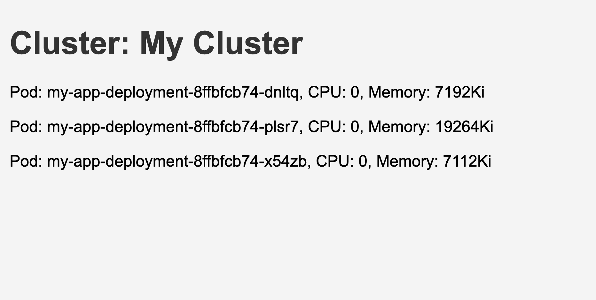

# k8s-dashboard

A simple dashboard using Go HTML templates on top of Kubernetes, running from Docker Desktop.

## Prerequisites

- [Docker Desktop](https://www.docker.com/products/docker-desktop)
- [kubectl](https://kubernetes.io/docs/tasks/tools/)
- [Go](https://golang.org/dl/)

## Deployment

To create the deployment in your Kubernetes cluster, run:

`kubectl apply -f deployment.yaml`

`go run main.go metrics.go` to start the server.

The server will start on http://localhost:8080.

## Endpoints

- /: Redirects to /dashboard
- /dashboard: Renders the dashboard with cluster metrics
- /static/: Serves static files (CSS, JS)

## Dashboard

The dashboard displays the following metrics for each pod in the default namespace:

CPU Usage
Memory Usage

## License
This project is licensed under the MIT License. See the LICENSE file for details.